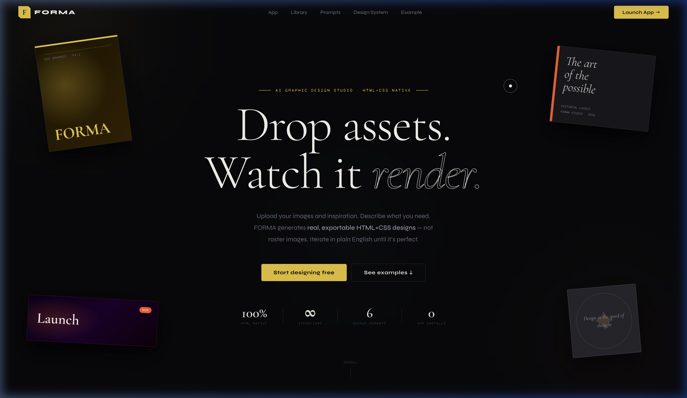
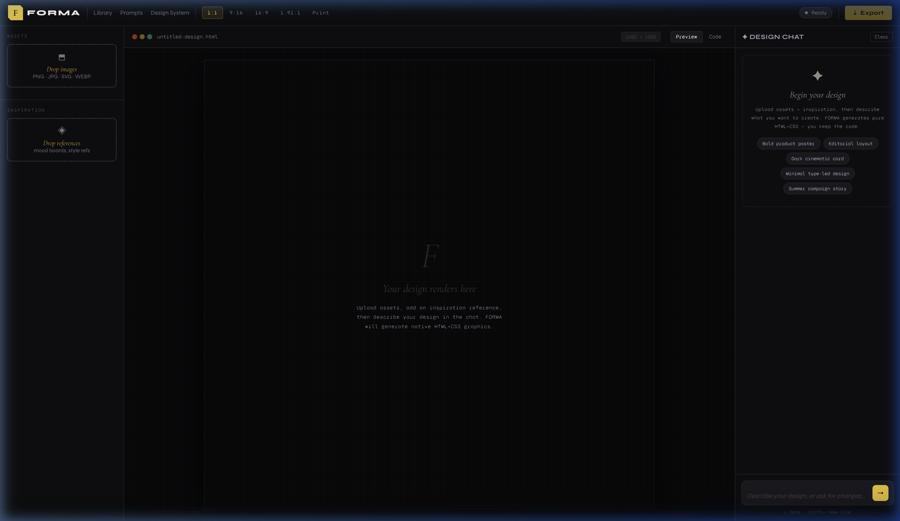
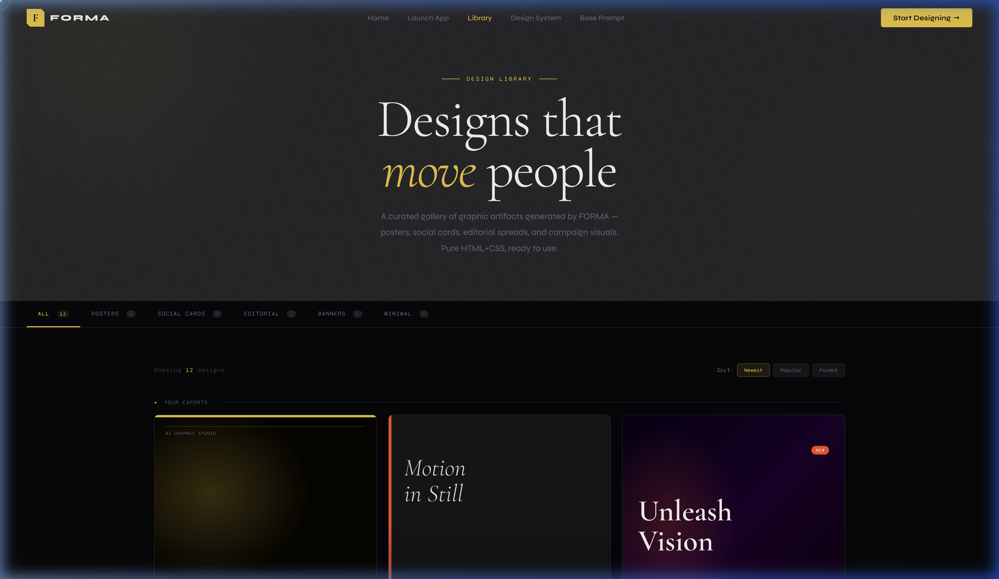

<div align="center">


# FORMA
**The AI Graphic Design Studio**
<br>
*Where HTML is the canvas, CSS is the brush, and AI is the artist.*

[](https://nodejs.org/)
[](https://playwright.dev/)
[](https://www.prisma.io/)
[](https://ai.google.dev/)

[Read the Docs](#docs) • [View Gallery](#gallery)

</div>

<br>







## ✨ The Difference: HTML is the Canvas
Every other AI design tool generates raster images — pixels locked in a JPG. FORMA generates **live HTML and CSS**. Your design is code. It's editable, scalable, animatable, and exactly what a developer would hand-off.

- **Infinitely scalable** — vector sharp at any size.
- **Developer ready** — edit the CSS in any code editor.
- **Embedded Assets** — images base64 encoded, keeping the file self-contained.
- **Pure Native Export** — download the raw `.html` or render to `.png`.

---

## 🛠 Features

### 1. Vision-First Asset Analysis
FORMA doesn't just accept your images — it sees them. It extracts color palettes, reads composition, and uses your inspirations as a genuine visual brief alongside your text prompt.

### 2. Live Split-Pane Studio Workspace
A modern three-panel layout puts your assets (left), the live design canvas (center), and the AI chat (right) in one view. What renders in the iframe is exactly what you get when you export.

### 3. Iterative Chat Memory
Refine your design in plain English. *"Make the background amber." "Push the headline bigger."* Because FORMA sees the live state of your canvas at every turn, it applies changes surgically without breaking things that are already working.

### 4. Robust Test Suite
Built-in **End-to-End Playwright Tests** ensuring:
- Pixel-perfect parity between browser renders and exported PNGs (`pixelmatch`).
- Full UI regressions testing (Gallery filtering, Prompt flows, Canvas formatting).

---

## 🚀 Quick Start (Local Development)

### Prerequisites
- Node.js (v18+)
- A [Google Gemini API Key](https://aistudio.google.com/app/apikey)

### Installation

1. **Clone the repository**
   ```bash
   git clone https://github.com/your-username/forma.git
   cd forma
   ```

2. **Install dependencies**
   ```bash
   npm install
   ```

3. **Configure the Environment**
   Create a `.env` file in the root directory:
   ```env
   GEMINI_API_KEY=your_gemini_api_key_here
   PORT=3000
   DATABASE_URL="file:./dev.db"
   ```

4. **Initialize the Database**
   ```bash
   npm run build
   ```
   *(This generates the Prisma client and applies the SQLite migrations).*

5. **Start the Studio**
   ```bash
   npm run dev
   ```
   Open `http://localhost:3000` in your browser.

---

## 🧪 Testing

We use [Playwright](https://playwright.dev/) for both UI interaction and visual parity testing to ensure that what the AI designs is exactly what exports to the user.

```bash
# Run all tests (UI Flows + Visual Parity)
npm test

# Run tests by fixture / font
npm run test:sans     # System Sans-serif baseline
npm run test:serif    # Playfair Display
npm run test:mono     # Space Mono

# Run test types
npm run test:parity   # Pixel-parity checks against html2canvas
npm run test:ui       # Launch the interactive Playwright UI dashboard
```

---


## 📁 Repository Structure

```tree
.
├── public/           # Static assets, CSS, images, client JS
├── views/            # Static HTML views (Homepage, App, Library)
├── routes/           # Express API handlers (Gemini API, Prisma CRUD)
├── tests/            # Playwright E2E and Visual Parity Test scripts
├── prisma/           # Database schema and SQLite migrations
├── server.js         # Main Express entry point
├── playwright.config.js
└── package.json
```

---

<div align="center">
<br>
<i>Design at the speed of thought.</i><br>
FORMA Studio · 2026
</div>
